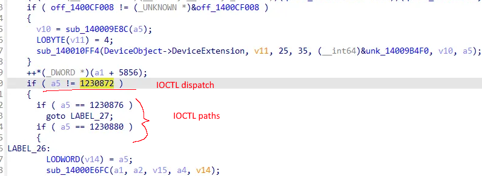
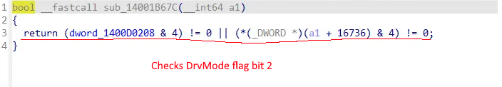
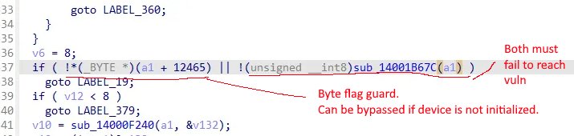
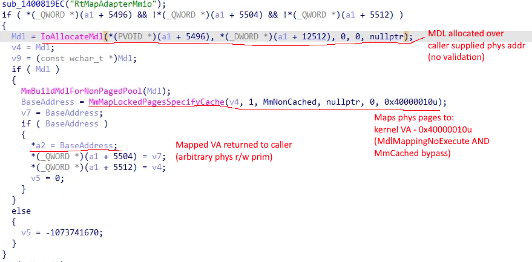

# realtek poc

rt26cx21x64.sys exploit (Realtek PCIe GbE/2.5GbE/5GbE family)

## Overview

OID 0xFF816871 maps the nic's mmio bar into the calling proc's virtual addr space,
(MmLockedPagesSpecifyCache), reachable from um via \\.\RealTekCard{GUID}

This IOCTL (0x0012C818) is gated by a fucking registry value lmfao (DrvMode=4)

Once we have mmio reg access, we program the nic's tx/rx descriptor rings in loopback
mode to r/w arbitrary phys addrs (AllocateUserPhysicalPages gives us PFNs).

## Reverse Engineering

### IOCTL Dispatch

IOCTL 0x12C008 (1230872) is the first vulnerable dispatch branch. 0x12C00C and 0x12C010 lead to different paths, a5 carries the IOCTL code through the switch



### Mode Gate

Before reaching the DMA path, the drv checks a global DrvMode flag, bit 2 must be set or we will never reach the vuln MMIO mapping path.



dword_1400D0208 and 4 is the check

### Bypass Guards

Two guards sit in front of the vuln pat bost must eval to false to get into
to the DMA path, these are a byte flag on the device extension and the mode check in the
previous image



!_(\_BYTE _)(a1 + 12465) is easy to bypass, we just have to make sure the device isnt initialized.

sub_14001B67C is also trivially easy.

### MDL Allocation

The driver allocates an MDL over a caller supplied phys addr with no validation,
there is no bounds or range validation, like nothing at all.



### Physical Mapping

The MDL is mapped into the kernel VA and the base address is given to the caller,
0x40000010 is MAP_NO_EXECUTE & MmNonCached.


MmMapLockedPagesSpecifyCache produces the mapped VA which is written to \*a2 and returned
to um, this gives us a arbitrary phys r/w prim.

## Requirements

- A compatible realtek adapter which matches [`nic.h`](./src/nic.h).

## Usage

Run as admin.

After first run, reg vals will be set and you will need to restart your pc.

For this to work, your NIC must be in a link UP state (so we can process descriptors).

Either:

- Plug in an ethernet cable to another pc, router or anything that will give link UP

OR

- Short pins 1-2 & 3-6 on the RJ45 port to bring the link UP

## Build

```
$ cmake -B build
$ cmake --build build --config Release
```

## Notes

- I stripped most of the interesting stuff (cr3, stomping, etc, etc) but this is the base POC
